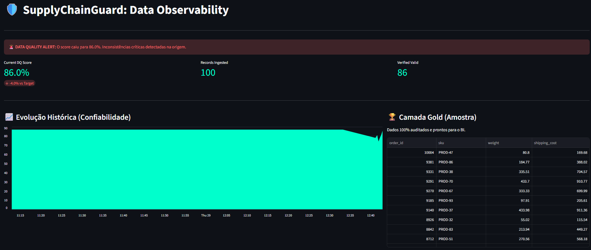

# 🛡️ SupplyChainGuard: Logistics Data Quality Framework



> *Observability Dashboard displaying a Quality Alert (Score: 86%) and the historical evolution of data integrity.*

**SupplyChainGuard** is a Data Engineering project focused on **DQaaP (Data Quality as a Product)**. It simulates a governance ecosystem for a logistics company, ensuring that only reliable data reaches the end user.

This project utilizes the **Medallion Architecture** to process and audit transport records, handling inconsistencies such as zero weights and duplicate orders.

---

## 🏗️ Pipeline Architecture

The project was built upon a dockerized infrastructure, following the layer flow:

| Layer | SQL Table | Objective |
| :--- | :--- | :--- |
| **Bronze** | `stg_logistica` | Storage of newly ingested raw data (Staging). |
| **Silver** | `Auditoria` | Processing layer where quality rules are applied. |
| **Gold** | `gold_logistica_limpa` | Certified, sanitized data ready for BI/Dashboard. |

---

## ⚖️ Data Quality Metric (DQ Score)

Data reliability is measured through an auditing algorithm that calculates the record compliance index:

$$Score = \left( \frac{\text{Valid Records}}{\text{Total Records}} \right) \times 100$$

If the Trust Score falls below **90%**, the system issues an integrity alert (as seen in the image above), ensuring data product governance.

---

## 🛠️ Technologies & Tools

* **Language:** Python 3.x (Pandas, SQLAlchemy).
* **Database:** PostgreSQL 13 (Docker).
* **Infrastructure:** Docker & Docker Compose.
* **Frontend/Dashboard:** Streamlit.

---

## 📂 Repository Structure

* `ingestion/`: Scripts for synthetic data generation and initial load (Bronze).
* `validation/`: The "heart" of the project. Contains the audit engine and persistence logic (Silver/Gold).
* `dashboard/`: Visual interface for monitoring quality metrics.
* `data/`: Local storage for temporary files (ignored by .gitignore).

---

## 🚀 How to Run

1.  **Start the Docker environment:**
    ```bash
    docker-compose up -d
    ```

2.  **Generate and load raw data:**
    ```bash
    python ingestion/supply_generator.py
    python ingestion/load_to_postgres.py
    ```

3.  **Run the audit and generate the Gold Layer:**
    ```bash
    python validation/persistence_gold.py
    ```

4.  **Start the Dashboard:**
    ```bash
    streamlit run dashboard/app.py
    ```

---
